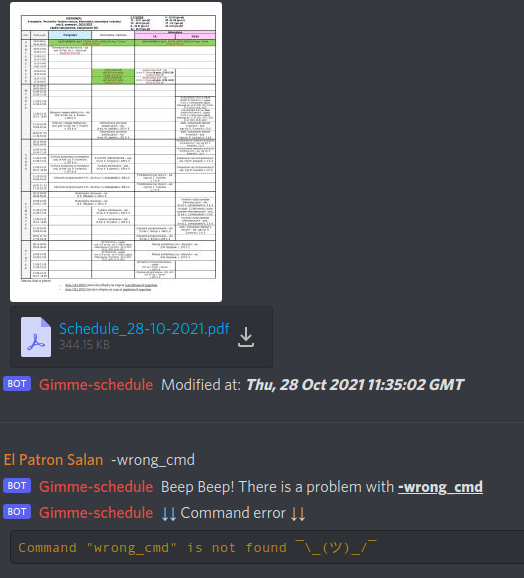

<h2 align="center">
Joshua: Shall we play a game?
</h2>


### Hello <viewer's_name>, a bit of composed information about me:
```yml
version: "3.9"

services:
  profile_readme:
    # Personal data
    name: El-Patron-Salan 
    occupation: Student
    contact: El Patron Salan#6684
    
    currently_learning:
      - "C++"
      - "Azure"
      - "IT Security"
    
    currently_working_on:
      - "Gimme-schedule"
      - "HackMe.NET"
      - "Console-Dictionary"
      
    in_free_time:
      - "Solving CTFs"
      - "Writing the personal app in Flutter"
      
    environment:
      OS: 'Unix/Linux'
```
    


<!--
**El-Patron-Salan/El-Patron-Salan** is a ✨ _special_ ✨ repository because its `README.md` (this file) appears on your GitHub profile.

Here are some ideas to get you started:
🐳
- 🔭 I’m currently working on ...
- 🌱 I’m currently learning ...
- 👯 I’m looking to collaborate on ...
- 🤔 I’m looking for help with ...
- 💬 Ask me about ...
- 📫 How to reach me: ...
- 😄 Pronouns: ...
- ⚡ Fun fact: ...
-->

<!--
<h2 align="center">
Joshua: Would you like to play a game?
</h2>

[](https://github.com/El-Patron-Salan/Gimme-schedule)

-->
